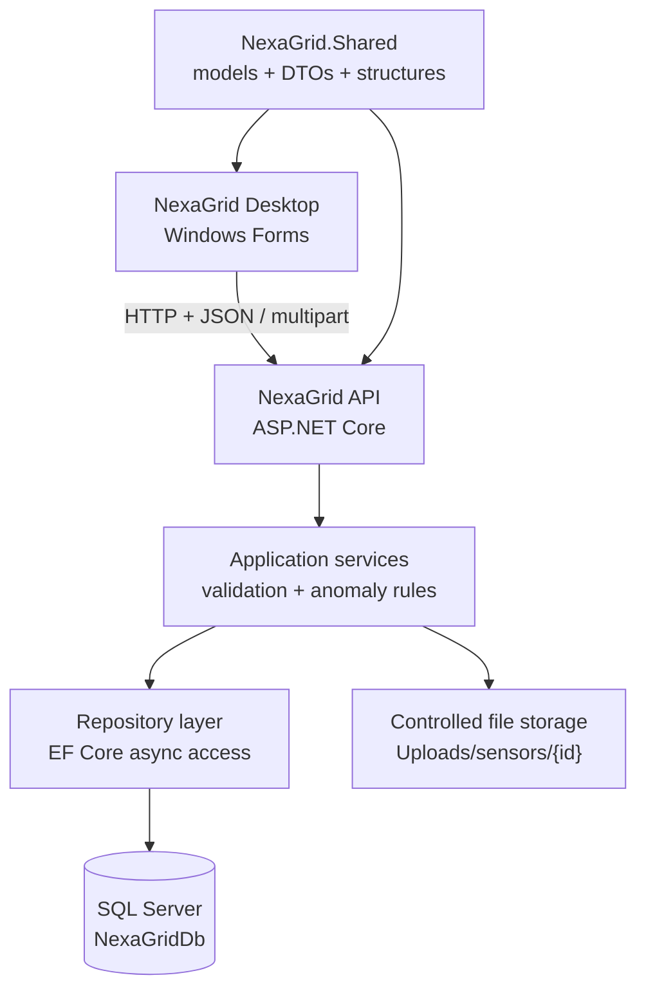

# NexaGrid IoT Operations Platform

NexaGrid is a Part 1 implementation of a Smart-X IoT operations platform. It combines a Windows Forms desktop client, an ASP.NET Core Web API, shared strongly typed contracts, Entity Framework Core, and SQL Server to register sensors, ingest and analyse telemetry, and manage sensor evidence attachments.

## Part 1 capabilities

- Responsive gateway dashboard with live API status
- Sensor and gateway registration with client- and server-side validation
- Strongly typed float, integer, Boolean, and text telemetry ingestion
- Threshold-based anomaly detection and recent-reading visualisation
- SQL Server persistence through Entity Framework Core repositories
- Generic telemetry packets and numeric operator overloading
- Jagged-array telemetry batching and recursive deployment-tree validation
- Securely constrained attachment upload, listing, download, and open workflows
- Immediate user feedback, loading states, validation messages, and API error handling

## Solution architecture



### Project responsibilities

| Project | Responsibility |
| --- | --- |
| `NexaGrid.Desktop` | Responsive WinForms dashboard, registry, telemetry, and attachment workspaces; asynchronous API communication. |
| `NexaGrid.API` | REST endpoints, validation, business rules, anomaly detection, repository coordination, and file handling. |
| `NexaGrid.Shared` | Shared models, DTOs, enums, generic types, operator overloads, collections, batching, and recursive validation. |
| `NexaGrid.API.Tests` | Automated API verification. |

## Technology stack

- .NET 10 and C#
- ASP.NET Core Web API
- Windows Forms
- Entity Framework Core 10
- Microsoft SQL Server Express
- xUnit

## Prerequisites

- .NET 10 SDK
- SQL Server Express available as `.\\SQLEXPRESS`
- EF Core command-line tools (`dotnet-ef`)
- Windows 10 or Windows 11 for the desktop application

## Configuration

The development connection string is stored in `src/NexaGrid.API/appsettings.Development.json`. The default database name is `NexaGridDb`. If your SQL Server instance differs, update `ConnectionStrings:NexaGridDatabase` before applying migrations.

The desktop client uses `http://localhost:5211` by default. Keep the API launch URL and the `ApiClient` base address aligned if the port is changed.

## Restore, build, and test

Run the following commands from the repository root:

```powershell
dotnet restore NexaGrid.sln
dotnet build NexaGrid.sln --configuration Release
dotnet test NexaGrid.sln --configuration Release --no-build
```

## Create or update the database

Install the EF Core tool once if required:

```powershell
dotnet tool install --global dotnet-ef
```

Apply the included migration:

```powershell
dotnet ef database update --project .\src\NexaGrid.API\NexaGrid.API.csproj
```

## Run the application

Open two PowerShell terminals at the repository root.

Terminal 1 - start the API:

```powershell
dotnet run --project .\src\NexaGrid.API\NexaGrid.API.csproj
```

Confirm the service is healthy:

```powershell
Invoke-RestMethod -Uri "http://localhost:5211/api/health" -Method Get
```

Terminal 2 - start the desktop client:

```powershell
dotnet run --project .\src\NexaGrid.Desktop\NexaGrid.Desktop.csproj
```

## Demonstration workflow

1. Start the API and confirm that the dashboard displays `API ONLINE`.
2. Open **Sensor Ingestion**, register a device and sensor, and confirm that it appears in the registry.
3. Open **Telemetry**, select the sensor, and submit an in-range reading.
4. Submit an out-of-range reading and confirm that the anomaly state and history update.
5. Open **Attachments**, choose the sensor, browse to an allowed file of 10 MB or less, and upload it.
6. Select the stored attachment and verify **Download** and **Download and Open**.

## API endpoints

| Method | Route | Purpose |
| --- | --- | --- |
| `GET` | `/api/health` | API health status |
| `GET` | `/api/sensors` | List registered sensors |
| `POST` | `/api/sensors` | Register a device and sensor |
| `POST` | `/api/telemetry` | Validate and ingest one telemetry reading |
| `GET` | `/api/telemetry/sensor/{sensorId}` | Retrieve recent telemetry |
| `POST` | `/api/telemetry/seed/{sensorId}` | Generate demonstration telemetry |
| `POST` | `/api/attachments/sensor/{sensorId}` | Upload a sensor attachment |
| `GET` | `/api/attachments/sensor/{sensorId}` | List a sensor's attachments |
| `GET` | `/api/attachments/{attachmentId}/download` | Download an attachment |

## Validation and security controls

- Data annotation and business-rule validation for sensor registration
- Type-aware telemetry parsing with meaningful `400 Bad Request` responses
- Unknown-resource handling with `404 Not Found`
- 10 MB multipart request and file-size limits
- Extension allow-list for JPG, JPEG, PNG, PDF, TXT, LOG, JSON, XML, CSV, YAML, YML, and CONF files
- Client filenames reduced to their safe filename component
- Server-generated GUID storage names and sensor-specific directories
- File paths resolved under the controlled application content root
- Cancellation tokens and asynchronous file/network/database operations

> The attachment implementation applies validation, constrained storage, and safe generated names. It does not claim application-level encryption of uploaded file contents; production deployment should add encryption at rest, malware scanning, authentication, authorisation, HTTPS enforcement, secrets management, and audit logging.

## Repository structure

```text
NexaGrid/
|-- src/
|   |-- NexaGrid.API/
|   |-- NexaGrid.Desktop/
|   `-- NexaGrid.Shared/
|-- tests/
|   `-- NexaGrid.API.Tests/
|-- NexaGrid.sln
`-- README.md
```

## Troubleshooting

- **API offline:** confirm the API terminal is running and listening on port `5211`.
- **Database connection failure:** verify SQL Server Express is running and the configured instance name is correct.
- **Migration failure:** confirm `dotnet-ef` is installed and run the update command from the repository root.
- **Locked build files:** close running API/Desktop processes, then run `dotnet clean NexaGrid.sln` before rebuilding.
- **Upload rejected:** check the extension and ensure the file is no larger than 10 MB.

## Part 1 scope

Part 1 includes sensor ingestion, telemetry monitoring, persistence, dashboard engagement, and attachments. Command Stream and Network Topology are intentionally presented as later-phase workspaces.

